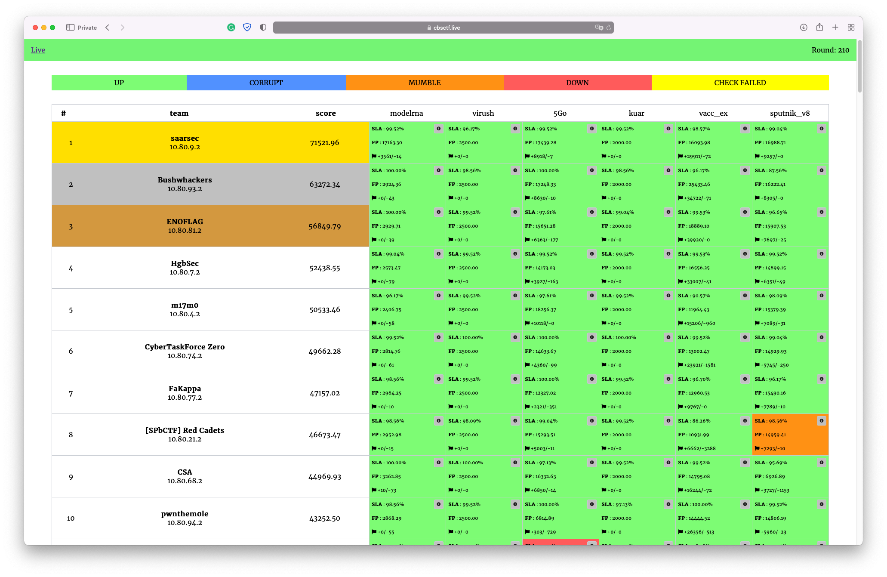

# Stay ~/ CTF 2022

The contest was held on February 6, 2022.

Repository contains source code of services, checkers and sploits.

[CTFTime.org event page](https://ctftime.org/event/1463)

## Results

[Full scoreboard](scoreboard/full.png)

## Services

| Service | Language | Checker | Sploits | Authors |
|---------|----------|---------|---------|---------|
| **[5Go](services/5Go/)** | Rust & Go | [Checker](checkers/5Go/) | [Sploits](sploits/5Go/) | [@pomo_mondreganto](https://github.com/pomo-mondreganto) |
| **[kuar](services/kuar/)** | C++ | [Checker](checkers/kuar/) | [Sploits](sploits/kuar/) | [@revker](https://github.com/revervand) |
| **[modelrna](services/modelrna/)** | Python | [Checker](checkers/modelrna/) | [Sploits](sploits/modelrna/) | [@jnovikov](https://github.com/jnovikov) |
| **[sputnik_v8](services/sputnik_v8/)** | NodeJS | [Checker](checkers/sputnik_v8/) | [Sploits](sploits/sputnik_v8/) | [@iwalainz](https://github.com/iwalainz) |
| **[vacc_ex](services/vacc_ex/)** | Java | [Checker](checkers/vacc_ex/) | [Sploits](sploits/vacc_ex/) | [@jnovikov](https://github.com/jnovikov) & [@iwalainz](https://github.com/iwalainz) |
| **[virush](services/virush/)** | Bash | [Checker](checkers/virush/) | [Sploits](sploits/virush/) | [@keltecc](https://github.com/keltecc) |

## Infrastructure

- DevOps: [@pomo_mondreganto](https://github.com/pomo-mondreganto)
- Checksystem: [ForcAD](https://github.com/pomo-mondreganto/ForcAD)

## Writeups

- [virush](/sploits/virush/)
- [modelrna](/sploits/modelrna/)
- [vacc_ex](/sploits/vacc_ex/)

Coming...

## Donation

We organize our CTFs and trainings on a regular basis. Though our infrastructure is cost-optimized, it is not 0. So we are open for donations if you want to support us. Vulnbox costs ~5$ per team.

Paypal: https://www.paypal.me/pomomondreganto

Tinkoff (roubles or if you have a multi wallet card): https://www.tinkoff.ru/sl/3JBSc9Kgiy0

DStream: https://donate.stream/cbsctf

Bitcoin: 1F6XjKjCMvHseScedHyH2xFpLybFGAfgZP
